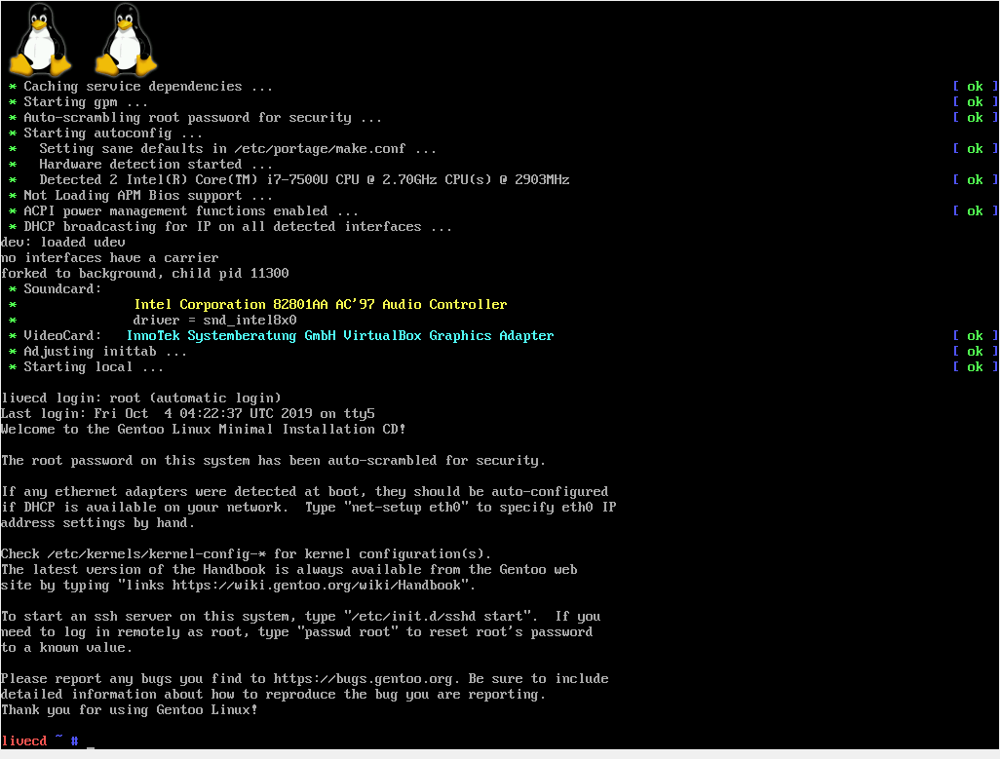
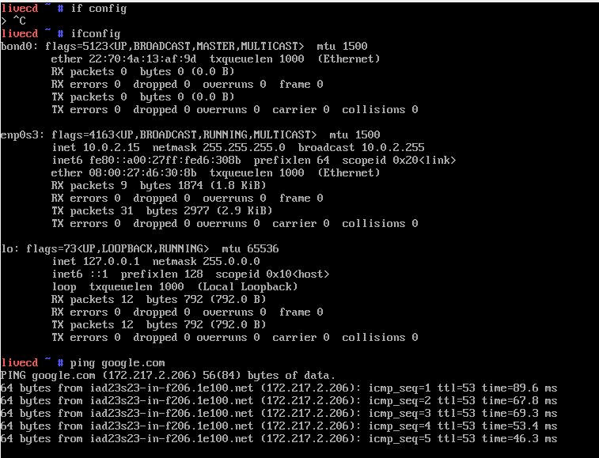
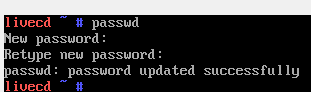
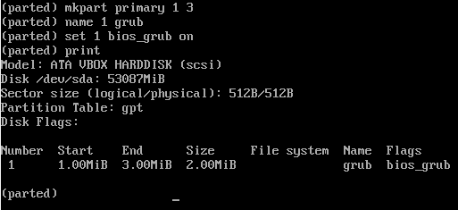
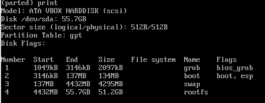
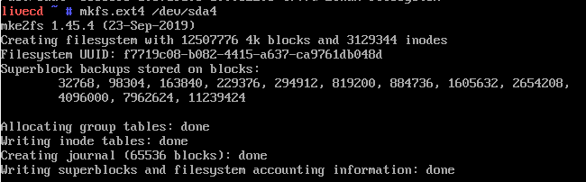
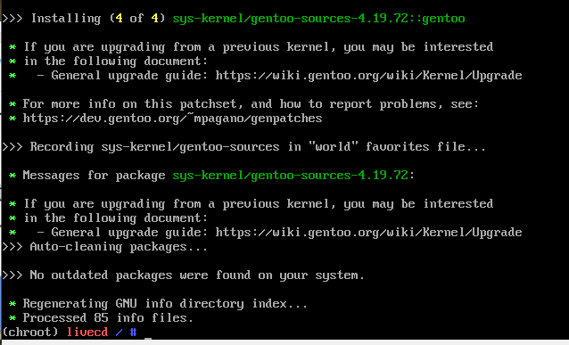
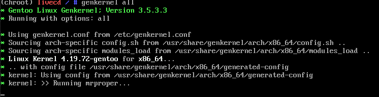

# Manual de Instalación | Gentoo | Virtual Box
## Datos de Estudiante
* Ricardo Antonio Cutz Hernández
* 201503476
* Práctica 2

## Iniciando la Instalación
* Debemos iniciar con el default kernel:
```bash
$ gentoo
```
* Nos mostrara la siguiente pantalla:




* Configuracion de la conexion de la red
```bash
$ ifconfig 

$ ping google.com
```


## Configurando Usuarios

* Instalaremos Sudo en Gentoo
```bash
$ PENDIENTE
```
* Haremos el cambio de password del usuario root:
```bash
$ passwd
```


* Agregaremos al usuario 201503476
```bash
$ useradd -m -G users,wheel,audio,video u201503476
$ passwd u201503476
```

## Particiones para el Disco
Para crear las particiones utilizaremos parted
* Ingresaremos al programa:
```bash
$ parted -a optimal /dev/sda
```

### Definiendo el etiquetado y Configuraciones iniciales
* usaremos el etiquetado gpt
```bash
(parted)$ mklabel gpt
```

* definieremos la unidad de medida
```bash
(parted)$ unit mib
```

### Creando las particiones del disco
#### GRUB
* Para crear la particion grub ejecutaremos lo siguiente:



* La particion anterior tiene un espacio de 2MB, usamos desde el Mb 1 al 3

#### Arranque
* Crearemos una particion de Arranque (128Mb):
```
(parted)$ mkpart primary 1 131
(parted)$ name 2 boot
```
#### Swap
* Crearemos una particion SWAP del doble de la ram (4096Mb)
```
(parted)$ mkpart primary 131 4227
(parted)$ name 3 swap
```
#### Root File System
* Crearemos la particion para el resto del disco
```
(parted)$ mkpart primary 4227 -1
(parted)$ name 3 rootfs
```

#### Resultado de las particiones:


### Sistema de Archivos
* Listamos las particiones con el sisguiente comando
```
$ fdisk -l
```


* Crearemos un sistema de archivos ext4 en la particion /dev/sda4
```
$ mkfs.ext4 /dev/sda4
```

* Crearemos swap:
```
$ mkswap /dev/sda3
```


### Montando particion al Root de Gentoo
```bash
$ mount /dev/sda4 /mnt/gentoo
```

## Instalando el Stage 3
* Para realizar este paso puede dirigirse a la documentacion:
```
https://wiki.gentoo.org/wiki/Handbook:AMD64/Installation/Stage/es
```

## Kernel de Linux

1. Instalando las fuentes del Kernel
```
$ emerge --ask sys-kernel/gentoo-sources
```


2. Instalando un modulo para informacion de pc
```
$ emerge --ask sys-apps/pciutils
```


### Usando genkernel
1. para utilizar el genkernel
```
$ emerge --ask sys-kernel/genkernel
```

2. editamos un archivo para darle la configuracion de boot
```
/dev/sda2	/boot	ext2	defaults	0 2
```

3. compilamos el kernel
```
$ genkernel all
```

