# Manual de Instalación | Gentoo | Virtual Box
## Datos de Estudiante
* Ricardo Antonio Cutz Hernández
* 201503476
* Práctica 2

## Iniciando la Instalación
* Debemos iniciar con el default kernel:
```bash
$ gentoo
```
* Nos mostrara la siguiente pantalla:

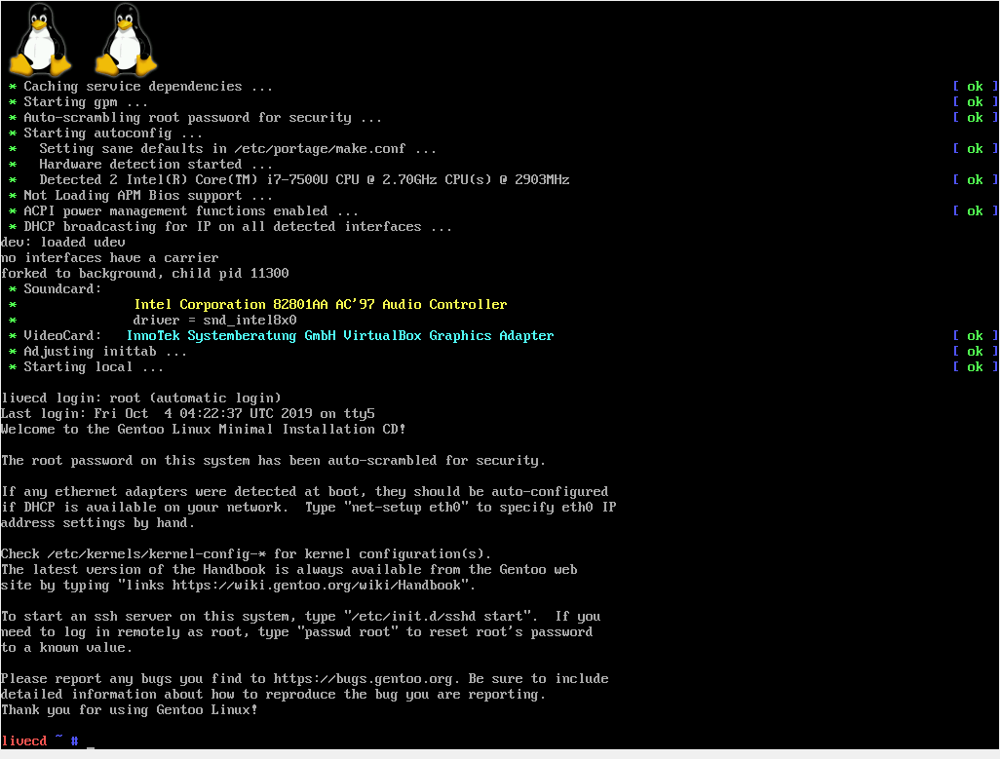


* Configuracion de la conexion de la red
```bash
$ ifconfig 

$ ping google.com
```
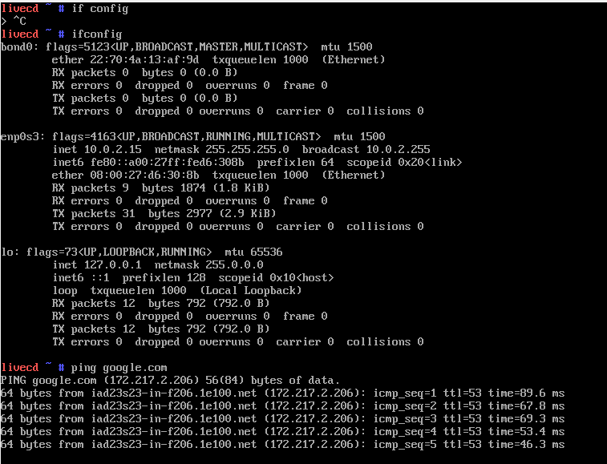

## Configurando Usuarios

* Instalaremos Sudo en Gentoo
```bash
$ PENDIENTE
```
* Haremos el cambio de password del usuario root:
```bash
$ passwd
```
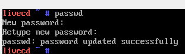

* Agregaremos al usuario 201503476
```bash
$ useradd -m -G users,wheel,audio,video u201503476
$ passwd u201503476
```

## Particiones para el Disco
Para crear las particiones utilizaremos parted
* Ingresaremos al programa:
```bash
$ parted -a optimal /dev/sda
```

### Definiendo el etiquetado y Configuraciones iniciales
* usaremos el etiquetado gpt
```bash
(parted)$ mklabel gpt
```

* definieremos la unidad de medida
```bash
(parted)$ unit mib
```

### Creando las particiones del disco
#### GRUB
* Para crear la particion grub ejecutaremos lo siguiente:

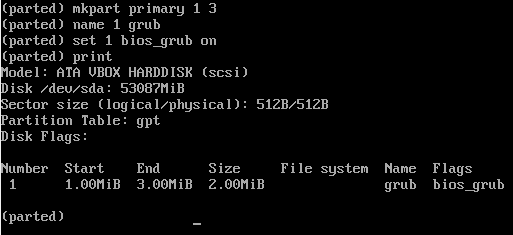

* La particion anterior tiene un espacio de 2MB, usamos desde el Mb 1 al 3

#### Arranque
* Crearemos una particion de Arranque (128Mb):
```
(parted)$ mkpart primary 1 131
(parted)$ name 2 boot
```
#### Swap
* Crearemos una particion SWAP del doble de la ram (4096Mb)
```
(parted)$ mkpart primary 131 4227
(parted)$ name 3 swap
```
#### Root File System
* Crearemos la particion para el resto del disco
```
(parted)$ mkpart primary 4227 -1
(parted)$ name 3 rootfs
```

#### Resultado de las particiones:
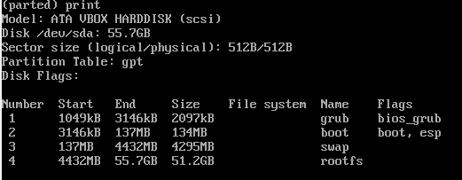

### Sistema de Archivos
* Listamos las particiones con el sisguiente comando
```
$ fdisk -l
```
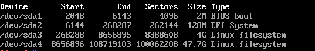

* Crearemos un sistema de archivos ext4 en la particion /dev/sda4
```
$ mkfs.ext4 /dev/sda4
```
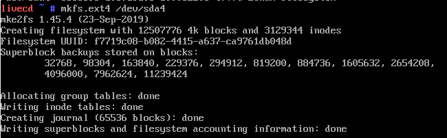
* Crearemos swap:
```
$ mkswap /dev/sda3
```
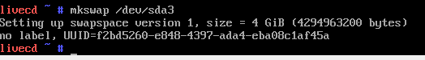

### Montando particion al Root de Gentoo
```bash
$ mount /dev/sda4 /mnt/gentoo
```

## Instalando el Stage 3
* Para realizar este paso puede dirigirse a la documentacion:
```
https://wiki.gentoo.org/wiki/Handbook:AMD64/Installation/Stage/es
```

## Kernel de Linux

1. Instalando las fuentes del Kernel
```
$ emerge --ask sys-kernel/gentoo-sources
```
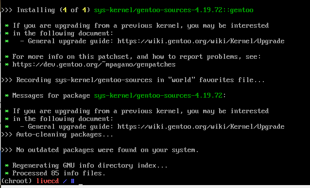

2. Instalando un modulo para informacion de pc
```
$ emerge --ask sys-apps/pciutils
```
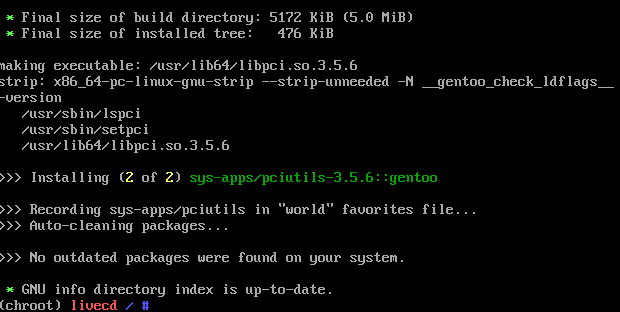

### Usando genkernel
1. para utilizar el genkernel
```
$ emerge --ask sys-kernel/genkernel
```

2. editamos un archivo para darle la configuracion de boot
```
/dev/sda2	/boot	ext2	defaults	0 2
```

3. compilamos el kernel
```
$ genkernel all
```
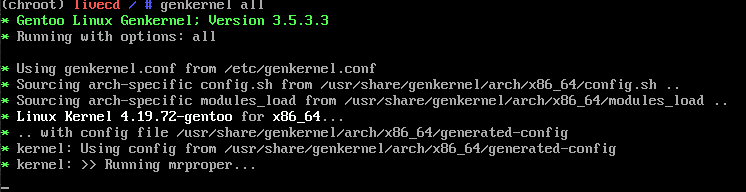

4. Kernel Compilado exitosamente

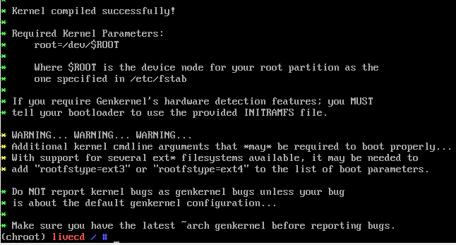

5. Demás configuraciones puede consultar la documentación para ser más especifica.

## Instalación de Requerimientos de Práctica

### Conexion a Internet
1. Instalaremos el paquete 'dhcpcd'
```
$ emerge --ask dhcpcd
```
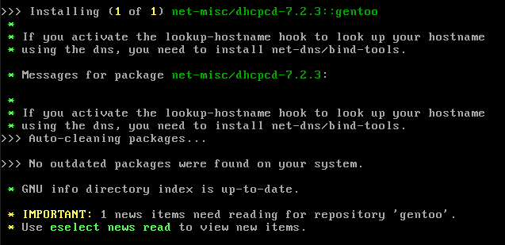

2. Buscamos nuestra interfaz
```
$ ip addr
```

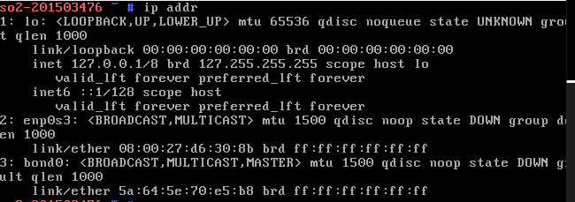

3. Configuramos la interfaz que vemos en la salida anterior
```
$ dhcpcd enp0s3
```

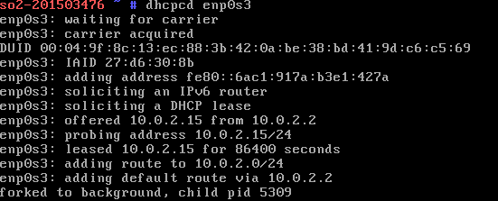

4. Comprobamos conectividad

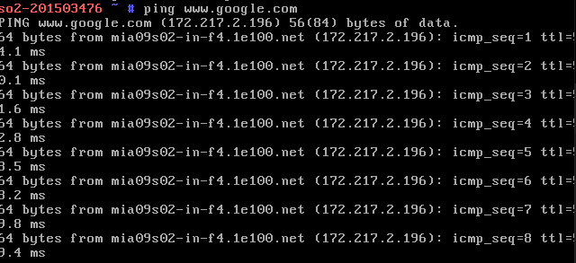

## Instalacion de SUDO y Creacion de Grupo
1. Instalamos SUDO con el siguiente comando

```
$ emerge --ask app-admin/sudo
```


2. Creamos el grupo Sopes2

```
$ groupadd sopes2
```

3. Agregamos root y u201503476 al grupo Sopes2
```
$ usermod -a -G sopes2 root
$ usermod -a -G sopes2 u201503476
```

## Creacion de la carpeta: practica1
1. Creamos la carpeta:
```
$ sudo mkdir practica1
```

2. Cambiamos el propietario de la carpeta
```
$ sudo chown -R u201503476:sopes2 practica1/
```

3. Para dar permisos de lectura, escritura y ejecucion al owner
```
$ sudo chmod +rwx practica1/
```

4. Para dar permisos de lectura, escritura y ejecucion al grupo
```
$ sudo chmod g+rwx practica1/
```

## Instalaciones de aplicaciones faltantes

1. Linux Headers
```
$ emerge --ask sys-kernel/linux-headres
```
2. Make
```
$ make --version
```
3. Perl
```
$ emerge --ask dev-lang/perl
```
4. gcc
```
$ gcc --version
```
5. build-essential

## Modificacion de parametros de kernel

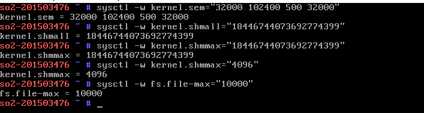

## Screenshots
1. uname -a 

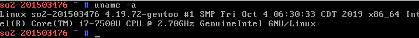

2. hostname

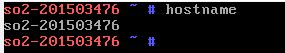

3. sysctl -a | grep sem

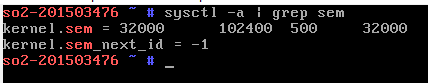

4. sysctl -a | grep shm

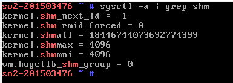

5. sysctl -a | grep file

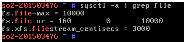

6. xclock

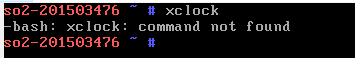

7. cat /etc/passswd

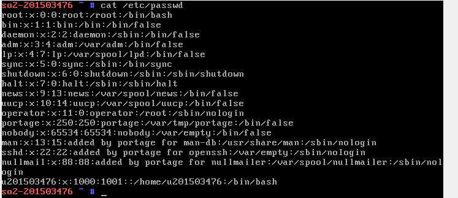

8. car /etc/Group

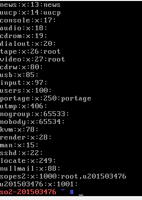

9. free -m 

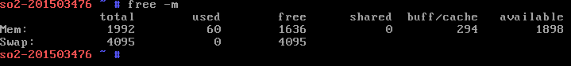

10. df -h

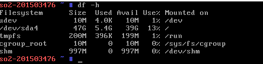

11. ping -c3 google.com

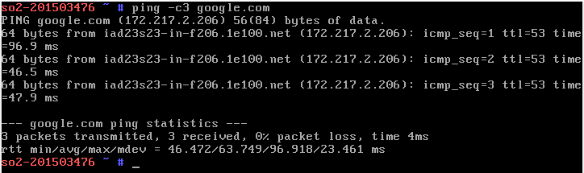